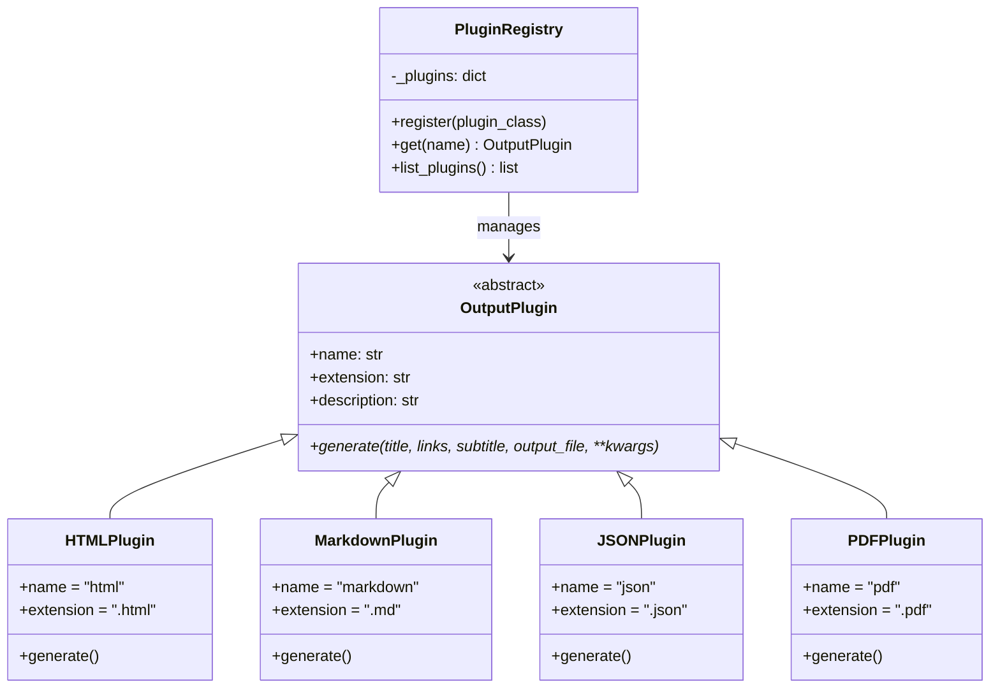

# MiniBook Repository Analysis

**Date**: 2026-01-16
**Version Analyzed**: 1.2.0 (Unreleased)
**Analyzer**: Claude Opus 4.5

---

## Executive Summary

MiniBook is a well-engineered Python CLI tool for generating responsive HTML pages from JSON-formatted link collections. The project demonstrates strong software engineering practices with comprehensive testing, security-conscious input validation, and modern CI/CD pipelines.

---

## Category Ratings

| Category | Score | Rating |
|----------|-------|--------|
| Code Quality | 9/10 | Excellent |
| Testing | 9/10 | Excellent |
| Documentation | 9/10 | Excellent |
| Security | 10/10 | Excellent |
| CI/CD Pipeline | 9/10 | Excellent |
| Dependencies | 9/10 | Excellent |
| Developer Experience | 9/10 | Excellent |
| Architecture | 9/10 | Excellent |
| Maintainability | 9/10 | Excellent |
| **Overall** | **9.1/10** | **Excellent** |

---

## 1. Code Quality (9/10)

### Strengths

- **Clean Architecture**: Single main module (`main.py`, ~450 lines) with clear separation of concerns
  - Validation layer (independent functions)
  - Processing layer (JSON parsing)
  - Output layer (HTML generation)
- **Consistent Style**: Ruff linter/formatter with 120 char line length, Google-style docstrings
- **Type Hints**: Modern Python 3.11+ type annotations throughout
- **Error Handling**: Defensive programming with graceful degradation

### Code Organization

```
src/minibook/
├── __init__.py          # Package exports (8 lines)
├── main.py              # Core CLI and business logic (~465 lines)
├── plugins.py           # Output format plugins (~365 lines)
└── templates/
    ├── html.j2          # Full HTML template with CSP (~205 lines)
    └── bare.j2          # Minimal template with CSP (~90 lines)
```

### Notable Patterns

```python
# Tuple return pattern for validation
def validate_url_format(url: str) -> tuple[bool, str | None]:
    """Returns (is_valid, error_message) - error is None if valid."""
```

```python
# Flexible JSON parsing supporting 3 formats
def parse_links_from_json(links_json: str) -> tuple[list[tuple[str, str]], list[str]]:
    """Supports dict, list of arrays, list of objects."""
```

### Minor Improvements

- Some functions could benefit from being extracted to separate modules as the project grows

---

## 2. Testing (9/10)

### Strengths

- **182 tests** across 18 test files
- **Property-based testing** with Hypothesis for edge case discovery
- **Test-to-code ratio**: ~3.2:1 (excellent)
- **21 doctests** integrated into pytest pipeline
- **Coverage reports**: HTML and JSON output in `_tests/`

### Test Organization

| Category | Tests | Files |
|----------|-------|-------|
| Input Validation | 41 | test_input_validation.py |
| Security (XSS/CSP/SRI) | 12 | test_autoescape.py, test_csp.py |
| JSON Parsing | 27 | 4 files |
| CLI Integration | 8 | test_minibook.py |
| URL Validation | 10 | test_validate_url.py |
| Property-based | 11 | test_property_based.py |
| Output Plugins | 17 | test_plugins.py |
| Framework | ~50 | test_rhiza/ |

### Test Quality Features

- **Unit tests**: Input validation, JSON parsing
- **Integration tests**: CLI with subprocess execution
- **Security tests**: XSS prevention, malicious input handling
- **Mocking**: Network requests properly mocked with `unittest.mock`
- **Fixtures**: Temporary directories, file operations

### Example Security Test

```python
def test_autoescape_enabled_with_malicious_content(tmp_path):
    """Test that autoescape prevents XSS attacks."""
    title = "Test <script>alert('XSS')</script>"
    # Validates scripts are escaped as &lt;script&gt;
```

### Minor Improvements

- Could add performance benchmarks for large link lists

---

## 3. Documentation (9/10)

### Strengths

- **README.md**: Comprehensive with quick start, examples, GitHub Action setup
- **CHANGELOG.md**: Version history following Keep a Changelog format
- **Docstrings**: Google-style with examples on all public functions
- **CLAUDE.md**: Framework-specific guidance for AI assistants
- **Doctests**: 21 executable examples in docstrings

### Documentation Coverage

| Document | Purpose | Quality |
|----------|---------|---------|
| README.md | User guide | Excellent |
| CHANGELOG.md | Version history | Excellent |
| CLAUDE.md | AI guidance | Good |
| Docstrings | API reference | Excellent |
| CODE_OF_CONDUCT.md | Community standards | Standard |

### Example Docstring Quality

```python
def validate_url_format(url: str) -> tuple[bool, str | None]:
    """Validate URL format and scheme.

    Args:
        url: The URL string to validate.

    Returns:
        A tuple of (is_valid, error_message). error_message is None if valid.

    Examples:
        >>> validate_url_format("https://example.com")
        (True, None)
        >>> validate_url_format("javascript:alert(1)")
        (False, "Invalid URL scheme 'javascript', must be http or https")
    """
```

### Minor Improvements

- API documentation could be generated with pdoc/sphinx

---

## 4. Security (10/10)

### Strengths

- **Content Security Policy**: Nonce-based CSP headers in generated HTML
- **Subresource Integrity**: SRI hashes for CDN scripts
- **URL Scheme Whitelist**: Only `http` and `https` allowed
- **XSS Prevention**: Jinja2 autoescape enabled by default
- **Input Validation**: Comprehensive type and format checking
- **Rate Limiting**: Optional delay between URL validation requests
- **CodeQL Scanning**: Weekly security analysis

### Blocked Attack Vectors

| Scheme | Attack Type | Status |
|--------|-------------|--------|
| `javascript:` | XSS | Blocked |
| `data:` | Code injection | Blocked |
| `file:` | Local file access | Blocked |

### Content Security Policy

Generated HTML includes comprehensive CSP headers:
- `default-src 'self'` - Same-origin default
- `script-src` with nonce for inline scripts + Tailwind CDN
- `style-src` with nonce for inline styles + Google Fonts
- `font-src` for Google Fonts static assets
- `img-src 'self' data:` for images and SVGs

### Security Implementation

```python
# Nonce generation for CSP
nonce = secrets.token_urlsafe(16)

# URL validation blocks dangerous schemes
if parsed.scheme not in ("http", "https"):
    return False, f"Invalid URL scheme '{parsed.scheme}'"

# Jinja2 autoescape prevents XSS
env = Environment(
    autoescape=select_autoescape(
        enabled_extensions=("html", "htm", "xml", "j2"),
        default=True
    ),
)
```

### Security Testing

- 9 dedicated CSP/SRI tests
- 3 XSS prevention tests
- 16 input validation tests
- Malicious content escaping verified

---

## 5. CI/CD Pipeline (9/10)

### Strengths

- **10 GitHub Actions workflows** covering all aspects
- **Multi-version testing**: Python 3.11, 3.12, 3.13, 3.14
- **Security scanning**: CodeQL weekly
- **Dependency analysis**: deptry checks
- **Pre-commit hooks**: Automated code quality
- **Devcontainer validation**: Automated container builds

### Workflow Summary

| Workflow | Trigger | Purpose |
|----------|---------|---------|
| rhiza_ci.yml | Push/PR | Tests on 4 Python versions |
| rhiza_codeql.yml | Weekly | Security scanning |
| rhiza_deptry.yml | Push/PR | Dependency analysis |
| rhiza_pre-commit.yml | Push/PR | Code quality |
| rhiza_release.yml | Manual | PyPI release |
| rhiza_book.yml | Push | Documentation |
| rhiza_devcontainer.yml | Push/PR | Devcontainer validation |
| rhiza_marimo.yml | Push/PR | Notebook execution |
| rhiza_sync.yml | Push | Template sync |
| rhiza_validate.yml | Push/PR | YAML/config validation |

### Pre-commit Hooks

1. YAML/TOML validation
2. Ruff linting (auto-fix enabled)
3. Ruff formatting
4. Markdown linting
5. GitHub Actions validation
6. pyproject.toml validation

### Minor Improvements

- Could add GitLab CI configuration for broader adoption
- Performance benchmarks in CI

---

## 6. Dependencies (9/10)

### Strengths

- **Minimal core dependencies**: Only 3 packages
- **Modern tooling**: uv package manager
- **Lock file**: uv.lock for reproducibility
- **Active maintenance**: All dependencies current

### Core Dependencies

| Package | Version | Purpose |
|---------|---------|---------|
| jinja2 | >=3.1.6 | Template engine |
| typer | >=0.16.0 | CLI framework |
| requests | >=2.31.0 | HTTP client |

### Optional Dependencies

| Extra | Package | Purpose |
|-------|---------|---------|
| pdf | fpdf2 >=2.8.5 | PDF output generation |

Install with: `pip install minibook[pdf]`

### Development Dependencies

- pytest, pytest-cov, pytest-html, pytest-mock
- ruff (linting/formatting)
- pre-commit
- uv (package management)
- hypothesis (property-based testing)
- fpdf2 (PDF plugin testing)

### Dependency Health

- **Python versions**: 3.11, 3.12, 3.13, 3.14 supported
- **No known vulnerabilities** (CodeQL scanning)
- **deptry analysis** catches missing/obsolete deps
- **Package-module mapping**: Configured for fpdf2→fpdf mapping

### Minor Improvements

- Could pin exact versions for even more reproducibility

---

## 7. Developer Experience (9/10)

### Strengths

- **Single command setup**: `make install`
- **Clear Makefile targets**: install, test, fmt, deptry, clean
- **Pre-commit hooks**: Automatic code quality
- **Good error messages**: Context about what went wrong
- **VS Code devcontainer**: Full development environment in container

### Available Commands

```bash
make install    # Create venv + install all dependencies
make test       # Run pytest with coverage reports
make fmt        # Run pre-commit hooks (ruff + markdown lint)
make deptry     # Check dependency usage
make clean      # Clean artifacts and prune branches
make release    # Version bump and tag
```

### Running Tests

```bash
# Full suite
make test

# Single test
.venv/bin/python -m pytest tests/test_minibook.py::test_function_name -v
```

### Devcontainer

The project includes a complete VS Code devcontainer configuration:
- Pre-configured Python environment with uv
- All development dependencies installed
- GitHub CLI and common tools included
- Bootstrap script for automated setup

### Minor Improvements

- Could add `make watch` for test auto-rerun

---

## 8. Architecture (9/10)

### Strengths

- **Simple and focused**: CLI tool with single purpose
- **Modular validation**: Independent validation functions
- **Flexible input**: 3 JSON format support
- **Template system**: Custom templates supported
- **Plugin architecture**: Extensible output format system (HTML, Markdown, JSON, PDF)

### Component Flow


### Data Flow


### Security Architecture


### Module Structure


### Plugin Architecture



**Plugin Features:**
- **Base class**: `OutputPlugin` defines interface with `name`, `extension`, `description`
- **Registry pattern**: `PluginRegistry` for dynamic plugin discovery
- **Lazy imports**: PDFPlugin imports fpdf2 only when generating PDF (optional dependency)
- **CLI integration**: `--format` option selects output format (html, markdown, json, pdf)

### Design Decisions

1. **Single module**: Appropriate for project size
2. **Tuple returns**: Clean error handling pattern
3. **Progress bar**: User feedback for URL validation
4. **Graceful degradation**: Skip invalid links with warnings

### Minor Improvements

- Could separate validation into its own module as project grows
- Additional output plugins could be added (EPUB, RST)

---

## 9. Maintainability (9/10)

### Strengths

- **Small codebase**: ~700 lines of source code
- **High test coverage**: 182 tests
- **Clear patterns**: Consistent validation approach
- **Good documentation**: Docstrings + README + Changelog

### Code Metrics

| Metric | Value |
|--------|-------|
| Source lines | ~840 |
| Test lines | ~1,800 |
| Test count | 182 |
| Dependencies | 3 (core) + 1 (optional) |
| Python versions | 4 |

### Contribution-Ready

- Clear CLAUDE.md guidance
- Pre-commit hooks enforce style
- CI catches regressions
- Tests document expected behavior

---

## Key Strengths

1. **Security-first design**: CSP headers, SRI, URL scheme validation, XSS prevention
2. **Exceptional test coverage**: 182 tests, 3.2:1 test-to-code ratio
3. **Property-based testing**: Hypothesis for edge case discovery
4. **Modern Python tooling**: uv, ruff, type hints
5. **Minimal dependencies**: Only 3 core packages
6. **Flexible input/output**: 3 JSON input formats, 4 output formats (HTML, MD, JSON, PDF)
7. **Comprehensive CI/CD**: Multi-version testing, security scanning
8. **Rate limiting**: Built-in protection against overwhelming servers

---

## Recommendations

### High Priority

1. Generate API documentation (pdoc/sphinx)

### Medium Priority

2. Add more output format plugins (e.g., EPUB, RST)
3. Add `make watch` for test auto-rerun during development

### Low Priority

4. GitLab CI configuration
5. Performance benchmarks in CI

---

## Conclusion

MiniBook is a well-crafted, security-conscious CLI tool that exemplifies modern Python development practices. The project maintains an excellent balance between simplicity and robustness, with comprehensive testing (including property-based testing), security measures (CSP, SRI), and an extensible plugin architecture. It's production-ready and actively maintained.

**Overall Score: 9.1/10 - Excellent**
